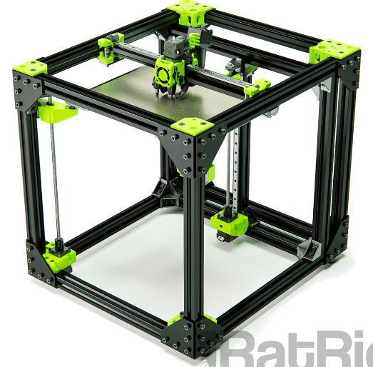

- grandi pezzi (volume 30x30x30cm)
- molto veloce e qualità alta

## Consigli di Vector 3D

- [Link video](https://www.youtube.com/watch?v=H2Yi9rEEUT4)
- Control board: le opzioni disponibili per avere RatOS
- Hotend: Revo Voron
  - Non in lista
  - Più pratico e facile da cambiare
- Extruder: LGX Lite
  - Più pratico cambiare il filamento (la cosa più importante per me)
  - Riapplica sempre la stessa tensione quando viene riagganciato il filo
- Printed Parts
  - Consiglia l'ABS per la miglior resistenza al calore (specie con enclosure)
  - Pezzi ottimizzati da stampare in ABS [link](https://github.com/AdamV3D?tab=repositories&q=V-Core&type&language&sort)  
- Stepper Motors
  - Quelli di default
- Flex Plate Print Surface
  - PEI non consigliato per il PLA ma per gli altri materiali
- Bed Heater
  - Quello di default, 220V
- Solid State Relay
  - Quello di default
- Power Supply
  - Vanno bene entrambi, il meanwell più qualità e più piccolo
- Fans
  - Vanno bene le due proposte (da prendere entrambe)
  - Se dovessero dare problemi consiglia le SUN
- Z Probe
  - Consiglia il pinda, sistema più rubusto e affidabile
- Endstops
  - Consiglia di prenderli ma montarli solo come seconda scelta
  - Meglio sensorless, senza cablaggi aggiuntivi
  - Dovrebbe essere già configurato in RatOS
- Spool holder
  - è ok, con le parti da stampare
- Enclosure
  - Professionale ma costosa, si può fare un po' di DIY
  - Fogli di plastica corrugati (polipropilene)

- Consigliati per la build
  - connettori JST-XH -> riguardare il video e completare
    - probabilmente si riferisce ai [[doc.ete.crimp.jstph2]] perché sono quelli dei NEMA17
  - crimpatrice SN-01BM

## DIY3DPRINTERS

- [Infill Honeycomb è meglio del Linear](https://www.youtube.com/watch?v=JUs79soqfVs)
- [Cablaggio SSR](https://www.youtube.com/watch?v=HYPdf97a3q4)
