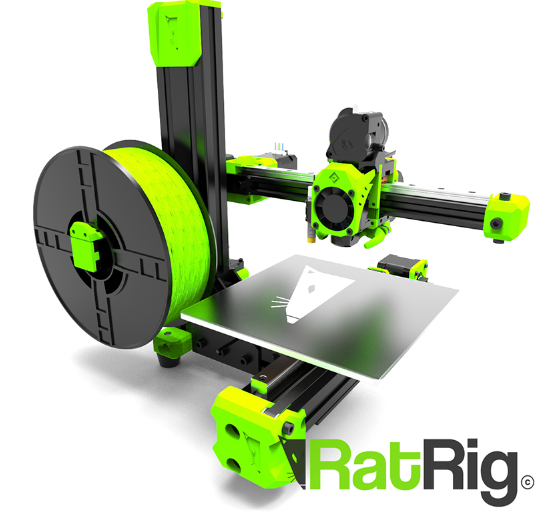

Durante il black friday costava 500 euro il set completo, 450 solo componenti, ora costa 670

- 18x18x18cm
- pezzi di medie dimensioni

Potrebbe essere la stampante che genera in sequenza:

- parti PETG per [[doc.3d.fdm.printers.rat-rig.v-core-3-1]]
- parti ASA per [[doc.3d.fdm.printers.voron.0-1]]
  - enclosure accrocchiato per trattenere calore
    - espulsione fumi
  - che a sua volta creerà i pezzi per la [[doc.3d.fdm.printers.voron.2-4]]
