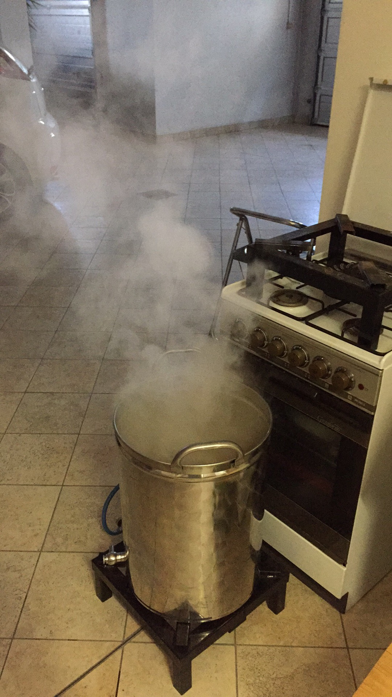

Amber lager brassata il 9 gennaio 2017.

### Fermentabili
| Tipologia                  | Percentuale |
|----------------------------|-------------|
| Malto Pilsner              | 40%         |
| Malto Vienna               | 40%         |
| Malto Cara Rosso (150 Ebc) | 8%          |
| Fiocchi d'orzo             | 5%          |
| Farro (non maltato)        | 3%          |
| Miele                      | 3%          |

### Luppoli
| Varietà            | Tempo  | Amaro   | Quantità |
|--------------------|--------|---------|----------|
| Hallertauer Magnum | 60 min | 31 IBU  | -        |
| Styrian Goldings   | 15 min | 1,6 IBU | 1,5 g/l  |
| Styrian Goldings   | 5 min  | 0,6 IBU | 1,5 g/l  |

### Lievito
Fermentis Saflager S-23

### Commenti
Questo rappresentò il primo tentativo di fare una lager leggermente ambrata. La cotta andò bene (il grist esageratamente complesso era dovuto a varie cose da finire), la fermentazione un po' meno (fermentò circa a 15°, senza dyacetil rest) mentre dopo feci un casino che la rovinò.

Infatti dovetti spostare la birra con la macchina dopo la fermentazione (e travaso) in un frigorifero in un'altra casa e dopo circa 3 settimane travasai due volte (perché imbottigliai insieme ad un'altra e avevo bisogno di fermentatori liberi). 

Venne una birra molto ossidata dal sapore metallico. Da rifare con grist ragionato e W34/70.

